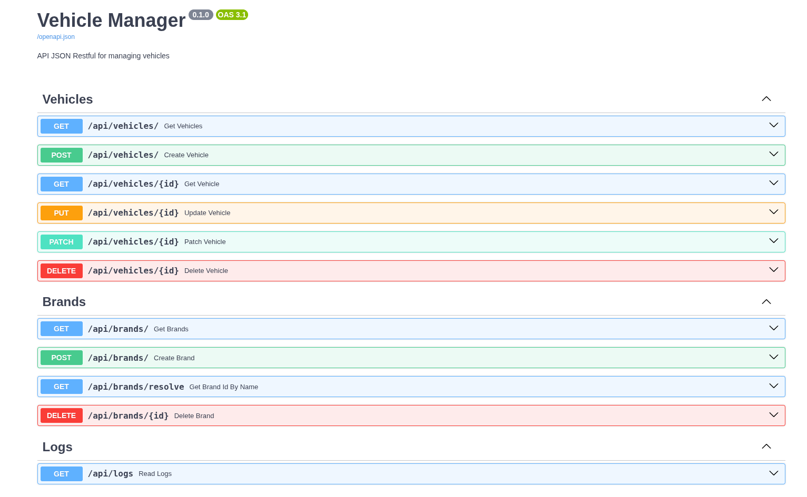
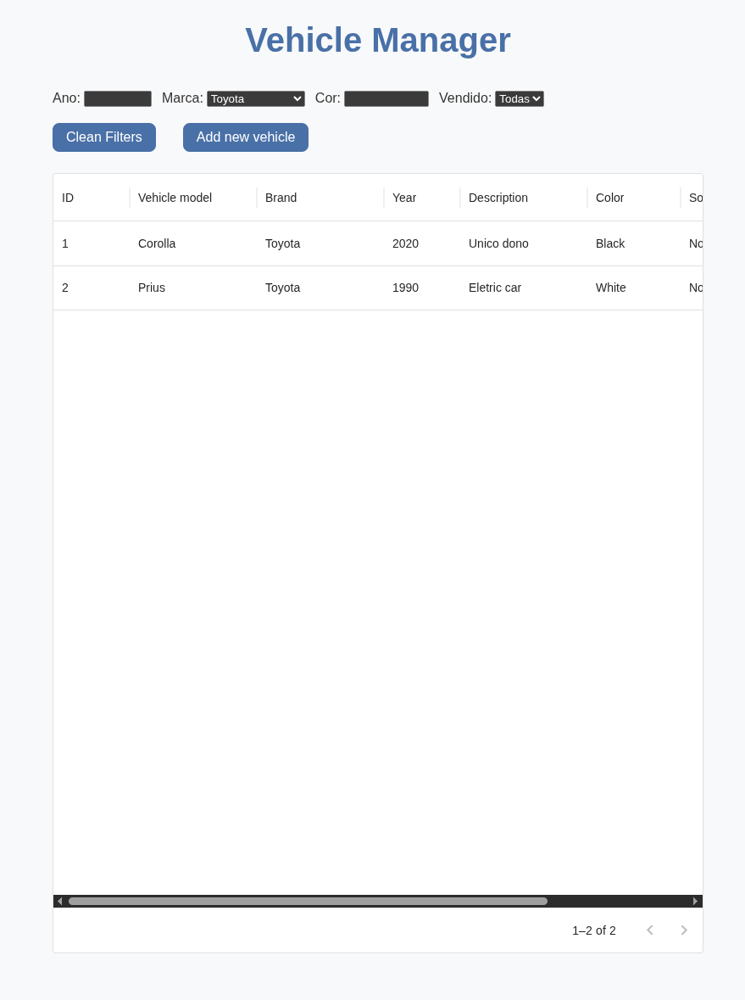
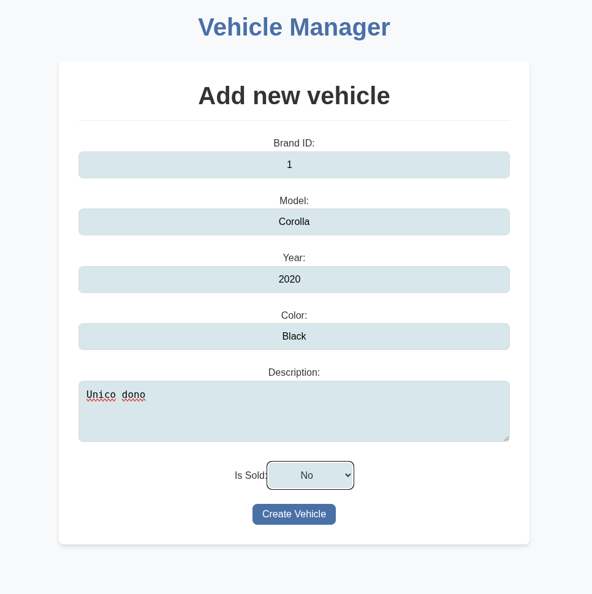
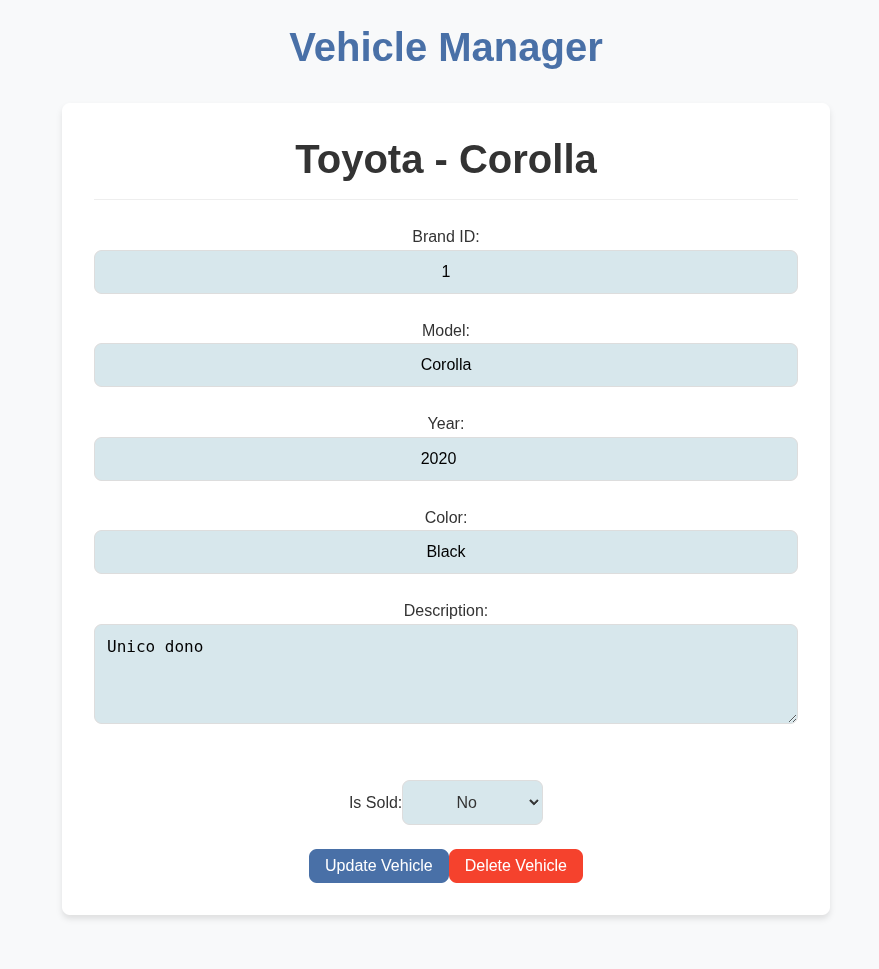

# Exercise 05 - Backend

## Problem Description

This exercise implements a Backend in python and Frontend in React to serve a CRUD for managing vehicles and brands.

---

## Project Structure

```
exercise-05/
├── backend/               # FastAPI app (Python)
├── frontend/              # React app (JavaScript)
├── media/                 # Media files
├── docker-compose.yml     # Sample docker compose file
└── README.md
```

---

## Screenshots





---

## Getting Started

### Prerequisites

- [Docker](https://www.docker.com/get-started)
- [Docker Compose](https://docs.docker.com/compose/)

### Quick Start

1. **Clone the repository:**

   ```bash
   git clone https://github.com/mateuspim/TINNOVA_DESAFIO_DEV
   cd exercise-05
   ```

2. **Copy and edit environment variables:**

   ```bash
   cp backend/.env.example backend/.env
   cp frontend/.env.example frontend/.env
   # Edit backend/.env as needed
   # Edit frontend/.env as needed
   ```

3. **Start the app:**

   ```bash
   docker compose up --build
   ```

4. **Access the app:**

   - Frontend: [http://localhost:3050](http://localhost:3050)
   - API docs: [http://localhost:8050/docs](http://localhost:8050/docs)

---

## Usage

1. **Register a new vehicle.**
2. **Filter your vehicles by color, brand, model and year.**
3. **Pagination with fastapi pagination.**
4. **Update your vehicle data.**


---

## Tech Stack

- **Backend:** FastAPI, SQLAlchemy, 
- **Frontend:** React
- **Database:** SQlite
- **Containerization:** Docker, Docker Compose

---

## API

- **API docs available at** [http://localhost:8050/docs](http://localhost:8000/docs)
- Example endpoints:
  - `GET /api/vehicles/?page=<int>&limit=<int>` — List vehicles
  - `GET /api/vehicles/{id}` — Get vehicle details by id
  - `POST /api/vehicles` — Register new vehicle
  - `PUT /api/vehicles/{id}` — Update vehicle data
  - `PATCH /api/vehicles/{id}` — Update vehicle data  
  - `DELETE /api/vehicles/{id}`  — Delete vehicle by id

  - `GET /api/brands/?page=<int>&limit=<int>` — List brands
  - `GET /api/brands/resolve?name=<str>` — Resolve brand by name
  - `POST /api/brands`  — Register new brand
  - `DELETE /api/brands/{id}`  — Delete brand by id

---

## Development

### Backend

```bash
cd backend
uvicorn app.main:app --reload
```

### Frontend

```bash
cd frontend
npm install
npm run dev
```

---
